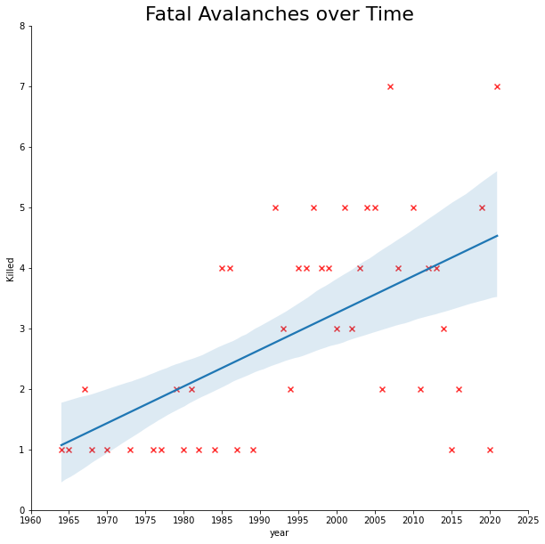
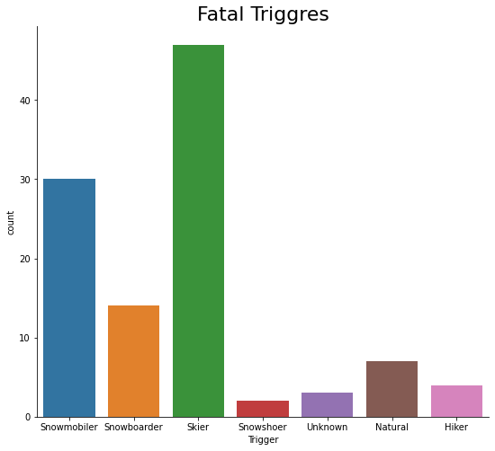
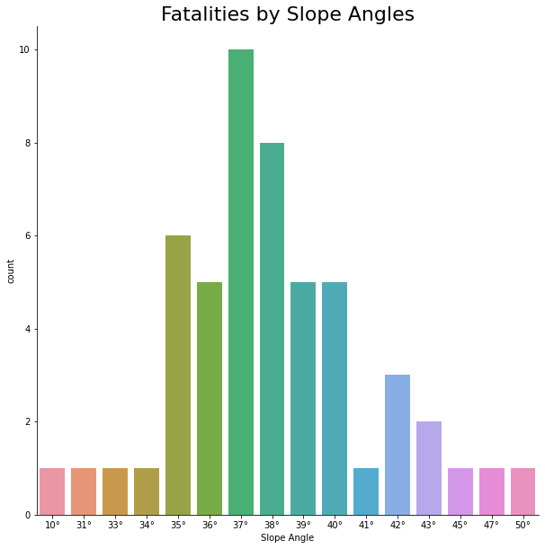
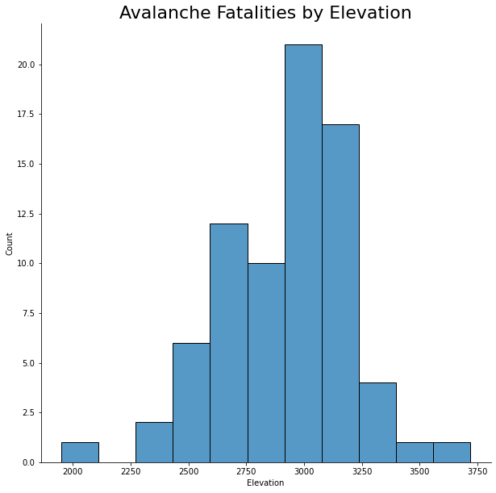
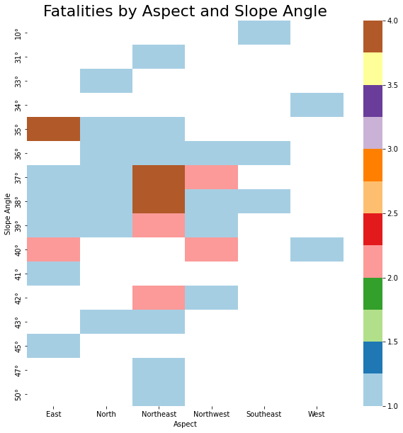

# avalanche-project

## Description

This notebook is base on the final chapter "*Avalanche Analysis and Ploting*" of the book [Learning the Pandas Library by Matt Harrison](https://www.amazon.com/Learning-Pandas-Library-Munging-Analysis/dp/153359824X).

The data used was crawling from the [Utah Avalanche Center](https://utahavalanchecenter.org/avalanches/fatalities) website using the **Scrapy Library**, and stored in a json file. The data consist in 110 observations that correspond to fatal avalanches, and 23 variables:

* **Observer Name**: Observer name.
* **Observation Date**: Date when the avalanche was upload to the page.
* **Avalanche Date**: Date when the avalanche occured.
* **Region**: Region
* **Location Name or Route**: Location or route name's.
* **Elevation**: Elevation at which the avalanche occur.                     
* **Aspect**: Aspect refers to the direction a slope faces.                
* **Slope Angle**: Slopes angle where the snow slid.            
* **Trigger**: Avalanches can be triggered either naturally or artificially.               
* **Trigger: additional info**: Additional information about the avalanche trigger.   
* **Avalanche Type**: Type of avalanche.               
* **Avalanche Problem**: Avalanche problems are eight types of snowpack instabilities commonly encountered in the mountains and referenced in avalanche forecasts.        
* **Weak Layer**: Weak layers are layers within the snowpack composed of snow crystals that are poorly bonded with the snow above or below them.      
* **Depth**: Depth of snowpack that slid during the avalanche.                
* **Width**: Width of snowpack that slid during the avalanche.                       
* **Vertical**: How many vertical feet the avalanche slid.                    
* **Carried**: Number of people carried by the avalanche.                    
* **Caught**: Number of people that where caught in the avalanche.                      
* **Buried - Fully**: Number of people fully buried in the avalanche.              
* **Killed**: Number of the people kill in the avalanche.                        
* **Coordinates**: Approximate latitude and longitude of the avalanche.                  
* **Buried - Partly**: Number of people partially Buried in the avalanche.             
* **Injured**: Number of people injured in the avalanche.

## Fatal Avalanches over time

## Fatalities by triggers

## Fatalities by Slope angles

## Fatalities by Elevation

## Fatalities by Aspect and Slope Angles

